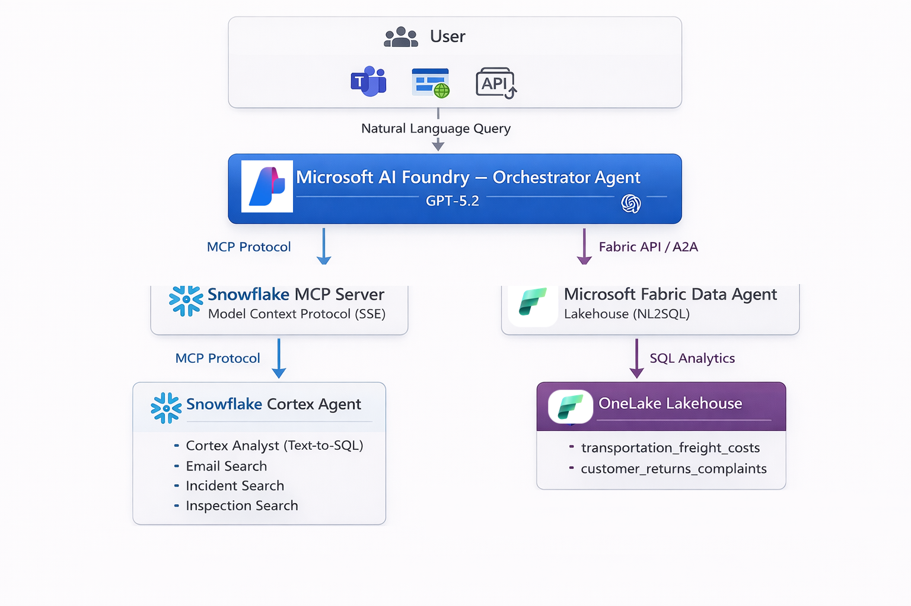

<div align="center">

# Multi-Agent Orchestrator

### Snowflake Cortex MCP + Microsoft AI Foundry + Fabric Data Agents

[](https://www.snowflake.com)
[](https://ai.azure.com)
[](https://fabric.microsoft.com)
[](https://openai.com)

[](https://modelcontextprotocol.io)
[](https://docs.snowflake.com/en/user-guide/snowflake-cortex)
[](https://opensource.org/licenses/MIT)

**A production-ready multi-agent architecture that routes natural language queries across Snowflake and Microsoft Fabric through a unified AI Foundry orchestrator.**

</div>

---

## Highlights

| Feature | Description |
|---|---|
| **Cortex Agent** | Text-to-SQL via Cortex Analyst + semantic search via 3 Cortex Search services |
| **MCP Server** | Exposes the Cortex Agent over the Model Context Protocol (SSE) |
| **AI Foundry Orchestrator** | GPT-5.2 powered agent that routes queries to the right data source |
| **Fabric Data Agent** | NL2SQL over Lakehouse Delta tables for supplementary datasets |
| **Cross-Platform Queries** | Single question can pull data from both Snowflake and Fabric simultaneously |

---

## Architecture



| Layer | Platform | Purpose |
|---|---|---|
| **AI Foundry Orchestrator** | Microsoft Azure | Routes user questions to the right data source |
| **Snowflake MCP Server** | Snowflake | Exposes Cortex Agent as an MCP tool over SSE |
| **Cortex Agent** | Snowflake | Orchestrates Cortex Analyst (SQL) + 3 Cortex Search services |
| **Fabric Data Agent** | Microsoft Fabric | NL2SQL over Lakehouse tables |

---

## Prerequisites

| Requirement | Details |
|---|---|
| **Snowflake account** | ACCOUNTADMIN role with Cortex features enabled |
| **Azure subscription** | Access to Microsoft Foundry (formerly Azure AI Foundry) |
| **Microsoft Fabric** | F2+ capacity (or Power BI Premium P1+) |
| **Azure CLI** | Installed and authenticated (`az login`) |
| **Python 3.10+** | For SDK-based agent creation (optional) |

---

## Quick Start

> **25 steps across 5 phases — from zero to a working multi-agent orchestrator.**

| Phase | Platform | Steps | What You Build |
|:---:|---|---|---|
| **1** | Snowflake | 1-9 | Database, tables, data, Cortex Search, Semantic View, Agent, MCP Server |
| **2** | Fabric | 10-15 | Workspace, Lakehouse, Delta tables, Fabric Data Agent |
| **3** | AI Foundry | 16-22 | GPT-5.2 deployment, orchestrator agent, MCP + Fabric tool wiring |
| **4** | All | 23 | End-to-end testing |
| **5** | Azure | 24-25 | Teams/Copilot deployment, API access |

---

## Repository Structure

```
.
├── README.md
├── transportation_freight_costs.csv        # Fabric Lakehouse data (40 rows)
├── customer_returns_complaints.csv         # Fabric Lakehouse data (40 rows)
└── setup/
    ├── 01_database_and_warehouse.sql       # Create DB + warehouse
    ├── 02_create_tables.sql                # Create 13 tables + stage
    ├── 03_load_structured_data.sql         # Load ~1,100 rows (7 tables)
    ├── 04_load_semi_structured_data.sql    # Load JSON into VARIANT columns
    ├── 05_load_unstructured_data.sql       # Load free-text data
    ├── 06_cortex_search_services.sql       # 3 Cortex Search services
    ├── 07_semantic_view.sql                # Semantic view for Cortex Analyst
    ├── 08_cortex_agent.sql                 # Cortex Agent (Analyst + Search)
    ├── 09_mcp_server.sql                   # MCP Server (SSE endpoint)
    └── 10_foundry_instructions.md          # AI Foundry orchestrator instructions
```

---

## Phase 1: Snowflake Setup (Scripts 01-09)

Run these SQL scripts **in order** in a Snowflake worksheet or via SnowSQL.

| Step | Script | What It Creates |
|---|---|---|
| 1 | `01_database_and_warehouse.sql` | `SUPPLY_CHAIN_DEMO` database, `SUPPLY_CHAIN_WH` warehouse (XS, auto-suspend 60s) |
| 2 | `02_create_tables.sql` | 7 structured + 3 semi-structured + 3 unstructured tables, `SEMANTIC_MODELS` stage |
| 3 | `03_load_structured_data.sql` | ~1,100 rows: suppliers (20), products (50), warehouses (8), inventory (162), POs (200), shipments (160), sales (500) |
| 4 | `04_load_semi_structured_data.sql` | ~160 JSON rows: shipment updates, IoT sensor logs, delivery tracking events |
| 5 | `05_load_unstructured_data.sql` | 63 text rows: supplier emails (30), incident reports (18), inspection notes (15) |
| 6 | `06_cortex_search_services.sql` | 3 search services: `SUPPLIER_COMMS_SEARCH`, `INCIDENT_REPORTS_SEARCH`, `WAREHOUSE_INSPECTIONS_SEARCH` |
| 7 | `07_semantic_view.sql` | `SUPPLY_CHAIN_ANALYTICS` semantic view (7 tables, 20 facts, 38 dimensions, 16 metrics, 5 verified queries) |
| 8 | `08_cortex_agent.sql` | `SUPPLY_CHAIN_AGENT` with 4 tools: Analyst + 3 Search services |
| 9 | `09_mcp_server.sql` | `SUPPLY_CHAIN_MCP_SERVER` exposing the agent via MCP (SSE) |

> **Note:** Wait 2-3 minutes after Step 6 for search services to finish indexing.

**Verify Phase 1:**
```sql
SHOW CORTEX SEARCH SERVICES IN SUPPLY_CHAIN_DEMO.PUBLIC;
SHOW AGENTS IN SUPPLY_CHAIN_DEMO.PUBLIC;
SHOW MCP SERVERS IN SUPPLY_CHAIN_DEMO.PUBLIC;
```

---

## Phase 2: Microsoft Fabric Setup

| Step | Action |
|---|---|
| 10 | Create workspace `SupplyChainDemo` in [Fabric](https://app.fabric.microsoft.com) (F2+ capacity) |
| 11 | Create Lakehouse `SupplyChainLakehouse` inside the workspace |
| 12 | Upload both CSV files to `Files/supply_chain_data/` in the Lakehouse |
| 13 | Load each CSV into Delta tables: `transportation_freight_costs`, `customer_returns_complaints` |
| 14 | Verify tables via SQL analytics endpoint |
| 15 | Create Fabric Data Agent `SupplyChainFreightReturnsAgent` with both tables, add instructions from Step 15 below, then **Publish** |

<details>
<summary><b>Fabric Data Agent instructions</b></summary>

```
You are a Supply Chain Data Agent specializing in transportation costs and customer returns.

Data Source: SupplyChainLakehouse with two tables:
1. transportation_freight_costs — carrier, origin_city, destination_warehouse_id, service_level,
   weight_kg, freight_rate_per_kg, fuel_surcharge_pct, total_freight_cost, invoice_status,
   detention_hours, detention_charge, damage_claim_amount, on_time, carrier_rating, notes
2. customer_returns_complaints — product_name, category, return_reason, reason_category,
   quantity_returned, refund_amount, return_channel, condition_on_return, rma_status,
   supplier_name, is_supplier_defect, complaint_severity, customer_satisfaction_score,
   sla_days, actual_resolution_days, sla_breached, resolution_type, agent_notes

Guidelines:
- For freight cost questions, use transportation_freight_costs
- For return/complaint questions, use customer_returns_complaints
- Always include trends, comparisons, totals
- Flag critical issues: disputed invoices, safety issues, SLA breaches
- Carrier ratings range 1-5 (5 = best), Severity: Critical > High > Medium > Low
```

</details>

---

## Phase 3: AI Foundry Orchestrator

| Step | Action |
|---|---|
| 16 | Create Foundry project `SupplyChainOrchestrator` at [ai.azure.com](https://ai.azure.com) (region: East US 2 recommended) |
| 17 | Deploy **gpt-5.2** model (deployment name: `gpt-5-2-supply-chain`) |
| 18 | Create OAuth security integration in Snowflake for MCP authentication (see `setup/09_mcp_server.sql`) |
| 19 | Create orchestrator agent with instructions from `setup/10_foundry_instructions.md` |
| 20 | Add Snowflake MCP Server as a tool (OAuth connection + MCP endpoint) |
| 21 | Connect Fabric Data Agent as a tool |
| 22 | Verify query routing rules match the table below |

**MCP Server Endpoint:**
```
https://<YOUR_ACCOUNT>.snowflakecomputing.com/api/v2/databases/SUPPLY_CHAIN_DEMO/schemas/PUBLIC/mcp-servers/SUPPLY_CHAIN_MCP_SERVER/sse
```

### Query Routing

| Query Topic | Routed To | Tool |
|---|---|---|
| Suppliers, products, inventory, POs, shipments, sales | Snowflake | MCP -> Cortex Analyst |
| Supplier emails, incident reports, inspections | Snowflake | MCP -> Cortex Search |
| Freight costs, carrier invoices | Fabric | Data Agent (NL2SQL) |
| Customer returns, complaints | Fabric | Data Agent (NL2SQL) |
| Cross-platform analysis | Both | MCP + Data Agent |

---

## Phase 4: Testing

Test these queries in the Foundry agent chat:

**Snowflake-routed:** "Which suppliers have reliability scores below 0.7?" | "Search supplier emails about pricing changes" | "What incidents involved temperature violations?"

**Fabric-routed:** "Which carriers have the highest freight costs per kg?" | "What products have the most customer returns due to defects?"

**Cross-platform:** "Which suppliers have both high delivery delays AND high return rates?"

---

## Phase 5: Production Deployment (Optional)

- **Teams/Copilot:** Deploy from Foundry agent > Deploy > Microsoft 365 Copilot or Teams
- **API Access:** Use Azure AI auth token with the Foundry REST API

---

## Troubleshooting

| Issue | Solution |
|---|---|
| MCP tool call times out | Snowflake MCP non-streaming timeout is 50s. Simplify queries or increase warehouse size |
| OAuth token errors | Verify client ID/secret. Ensure security integration is `ENABLED = TRUE` |
| Fabric Data Agent returns no results | Ensure tables are loaded (not just in Files folder). Refresh explorer |
| Model not available in region | Use East US 2 or Sweden Central for widest GPT-5.x availability |
| Cortex Search returns no results | Wait 2-3 minutes after creation for indexing |
| Semi-structured queries fail | Use path notation for VARIANT columns (e.g., `SENSOR_PAYLOAD:temperature`) |
| IP not allowed (error 390420) | Add IP to Snowflake network policy |

---

## Cleanup

<details>
<summary><b>Remove all resources</b></summary>

**Snowflake:**
```sql
DROP DATABASE IF EXISTS SUPPLY_CHAIN_DEMO;
DROP WAREHOUSE IF EXISTS SUPPLY_CHAIN_WH;
DROP SECURITY INTEGRATION IF EXISTS foundry_mcp_oauth;
```

**Fabric:** Delete data agent, lakehouse, and workspace.

**AI Foundry:** Delete agent, model deployment, and project.

</details>

---

## References

| Resource | Link |
|---|---|
| Snowflake Managed MCP Server | [docs.snowflake.com](https://docs.snowflake.com/en/user-guide/snowflake-cortex/cortex-agents-mcp) |
| Snowflake QuickStart: AI Foundry + MCP | [snowflake.com](https://www.snowflake.com/en/developers/guides/getting-started-with-ai-foundry-and-the-snowflake-managed-mcp/) |
| Microsoft Foundry Agent Quickstart | [learn.microsoft.com](https://learn.microsoft.com/en-us/azure/foundry/quickstarts/get-started-code) |
| Foundry: Connect to MCP Servers | [learn.microsoft.com](https://learn.microsoft.com/en-us/azure/foundry/agents/how-to/tools/model-context-protocol) |
| Create a Fabric Data Agent | [learn.microsoft.com](https://learn.microsoft.com/en-us/fabric/data-science/how-to-create-data-agent) |

---

<div align="center">

**Built with** [Snowflake](https://www.snowflake.com) + [Microsoft AI Foundry](https://ai.azure.com) + [OpenAI](https://openai.com) + [MCP](https://modelcontextprotocol.io)

[](https://github.com/curious-bigcat/snowflake-cortex-mcp-foundry-fabric-multi-agent)

</div>
